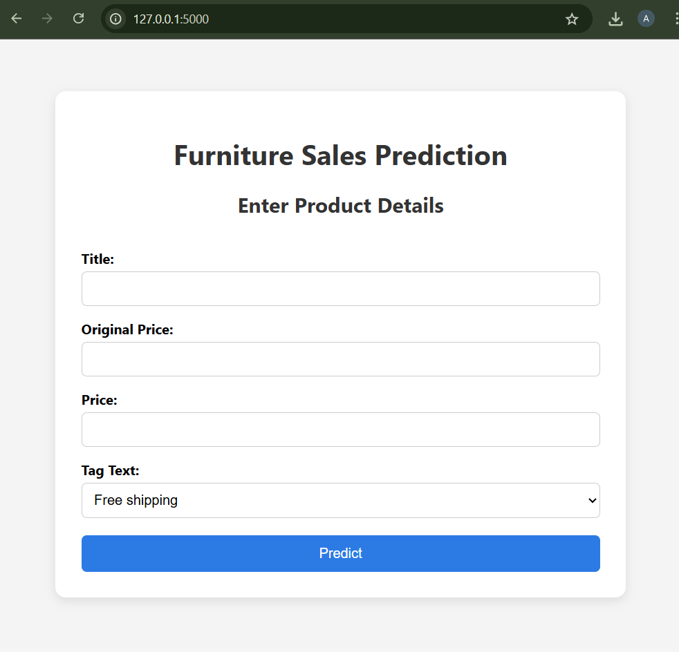
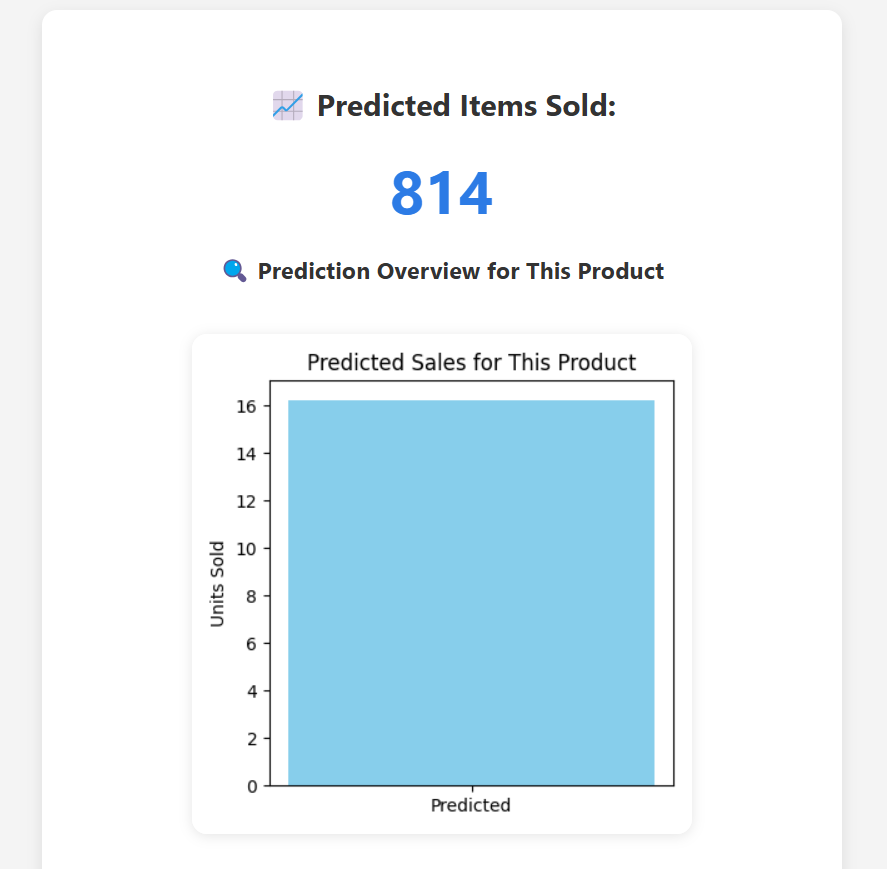

# 🪑 Furniture Sales Prediction Web App


---

## 🚀 Overview

This web application predicts how many units of a furniture product will be sold based on features like **product title**, **price**, **original price**, and **shipping tag**. It uses a trained machine learning model and also provides visual insights and a downloadable PDF report.

## 🖼️ UI Preview



## 🎯 Prediction Output Screenshot

Here’s a sample output after submitting product details:



---

## 🧩 Features

### 🔮 Prediction Engine
- Inputs: Product Title, Price, Original Price, Shipping Tag
- Automatically calculates **discount percentage**
- Uses a **TF-IDF + Random Forest** model to predict sales

### 📊 Graphical Insights
Interactive graphs shown:
- Predicted vs Actual Sales
- Price vs Predicted Sales
- Feature Importance
- Distribution of Sold Items
- Sales by Shipping Tag
- Sales by Discount Percentage
- Price Distribution
- Tag Breakdown, and more!

### 📄 PDF Report
- Downloadable report with:
  - Prediction result
  - Embedded analysis graphs
  - Copyright

---

## 🧠 Tech Stack

| Layer        | Tech                          |
|--------------|-------------------------------|
| Backend      | Python, Flask                 |
| ML/Processing| scikit-learn, pandas, NumPy   |
| Text Features| TF-IDF Vectorization          |
| Visualization| matplotlib, seaborn           |
| PDF Reports  | ReportLab                     |
| Frontend     | HTML, CSS (custom styles)     |

---

## 🗂️ Project Structure

```
ECOM_FURNITURE/
│
├── app.py
├── train_model.py
├── requirements.txt
├── README.md
│
├── data/
│   └── ecommerce_furniture_dataset_2024.csv
│
├── model/
│   ├── model.pkl
│   └── tfidf.pkl
│
├── static/
│   ├── styles.css
│   └── graphs/
│       └── *.png
│
├── templates/
│   ├── index.html
│   └── result.html
```

---

## 🛠️ How to Run

1. Install dependencies:
   ```bash
   pip install -r requirements.txt
   ```

2. Train the model (optional):
   ```bash
   python train_model.py
   ```

3. Run the Flask app:
   ```bash
   python app.py
   ```

4. Open browser at:
   ```
   http://localhost:5000
   ```
5. Create these folders and files:
   ```
   create model folder
   create model.pkl & tfidf.pkl
   keep both files empty
   (used to save trained models)
   ```
---

## 🧪 Example Prediction Flow

1. Fill the form on homepage
2. Click **Predict**
3. View result and insights
4. Click **Download as PDF** to save the report

---

## 👤 Developer

Made with ❤️ by [Aditya Arora](https://www.linkedin.com/in/NeuralAditya)  
&copy; 2025 Aditya Arora. All rights reserved.

---
